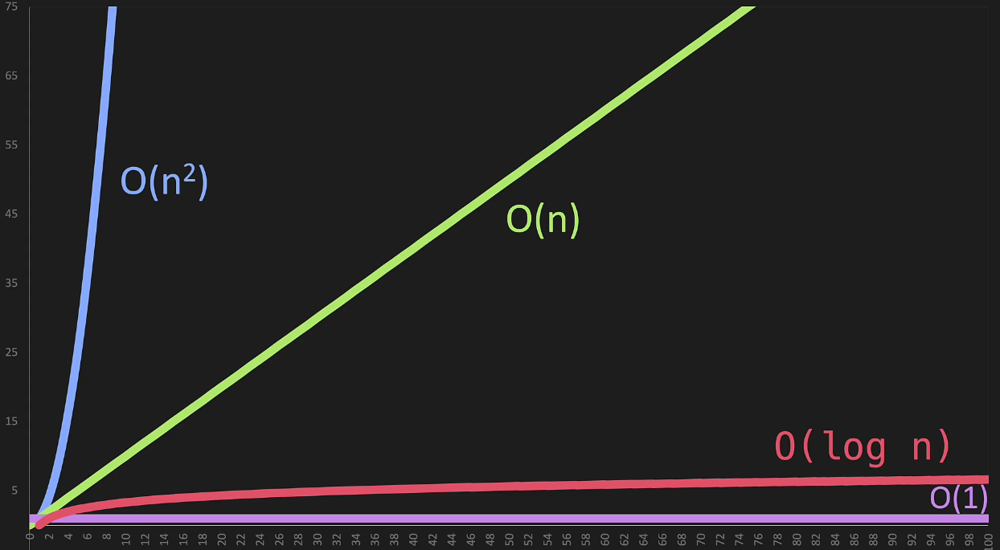

# Big O

Big O is used to **compare** **mathematically** two sets of code that accomplish exactly the same thing.

## Time Complexity

Time Complexity measures the number of operations that it takes to complete something.

## Space Complexity

Space Complexity measures the amount of memory the code needs. There are cases where Space Complexity is more important than Time Complexity.

## Worst Case

When dealing with Time and Space Complexity we commonly see these three Greek letters:

- Ω
> Stands for Best Case
- Θ
> Stands for Average Case
- O
> Stands for Worst Case

### O(n)

We have the following piece of code:
```java
public static void printItems(int n) {
    for (int i = 0; i < n; i++) {
        System.out.println(i)
    }
}
```
The above code is O(n) because our loop does n operations. If we graph O(n), we'll see that it always is a *straight line*. It is *proportional*.

### Drop Constants

In Big O we have a few ways to simplify things. Drop Constants is one of those.
We have the following piece of code:
```java
public static void printItems(int n) {
    for (int i = 0; i < n; i++) {
        System.out.println(i);
    }

    for (int i = 0; i < n; i++) {
        System.out.println(i);
    }
}
```
In the above code we have n + n operations => 2n => O(2n), but we drop the constant 2, hence the result is still O(n).

### O(n^2)

We have the following piece of code:
```java
public static void printItems(int n) {
    for (int i = 0; i < n; i++) {
        for (int j = 0; j < n; j++) {
            System.out.println(i + " " + j);
        }
    }
}
```
In the above code we have n * n operations => n^2 => O(n^2). If we graph O(n^2) we'll see that it grows much faster compared to O(n). If we have some code that is O(n^2) and we're able to re-write as O(n), that's actually a huge improvement in efficiency!

### Drop Non Dominants

Drop Non Dominants is another way to simplify Big O.
We have the following piece of code:
```java
public static void printItems(int n) {
    for (int i = 0; i < n; i++) {
        for (int j = 0; j < n; j++) {
            System.out.println(i + " " + j);
        }
    }

    for (int k = 0; k < n; k++) {
        System.out.println(k);
    }
}
```
If we examine the above code we see that we have a O(n^2) because of the nested for loop, and an O(n) afterwards. O(n^2) + O(n) => O(n^2 + n) => O(n^2), we **drop the non dominant term**, which in our case is n.

### O(1)

We have the following piece of code:
```java
public static int addItems(int n) {
    return n + n;
}
```
It doesn't matter if n is 10 or a billion. There's only going to be one operation. That is O(1). We can see that as n grows, the number of operations does not grow! O(1) is also known as **constant time**.

### O(log n)

Let's image we have a **sorted array**. In this array we going to search for a particular number. The quickest way to find the number, is to cut the array in half and check if the number we're searching for resides in the first or the second half. After finding in which half the number resides, we can remove the other half. We can keep doing this until we find the number. This is O(log n).

### Graphs



### Big O in Arrays vs Linked List

Comparing Arrays and linked Lists

| | Array | Linked List |
|-| ----- | ----------- |
|Cost of accessing elements | O(1) | O(n) |
|Insert/Remove from beginning | O(n) | O(1) |
|Insert/Remove from end | O(1) | O(n) |
|Insert/Remove from middle | O(n) | O(n)|


